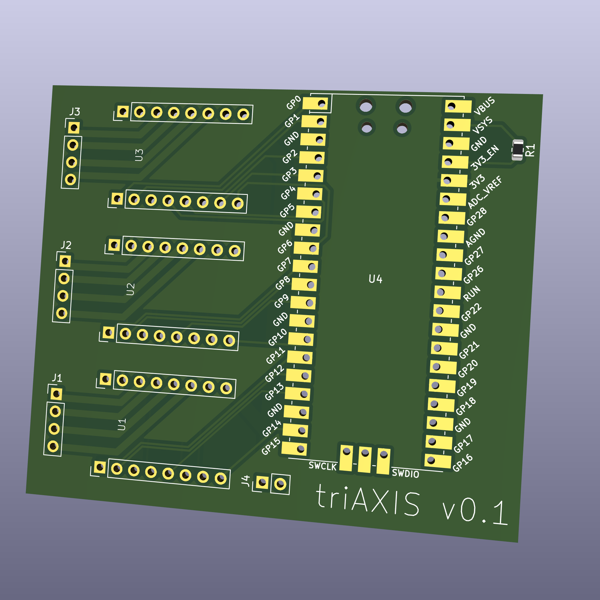

# triaxis

3-axis RPi Pico based stepper driver, using TRINAMIC / ANALOG DEVICES TMCSILENTSTEPSTICK SPI (TMC2130) modules.

Uses https://github.com/ncarandini/KiCad-RP-Pico for the Pico footprint.

## To Do

* Add 100+uF capacitor on 12V power rail below each driver, as datasheet mentions "A minimum capacity of 100µF near the driver is recommended for best performance".
